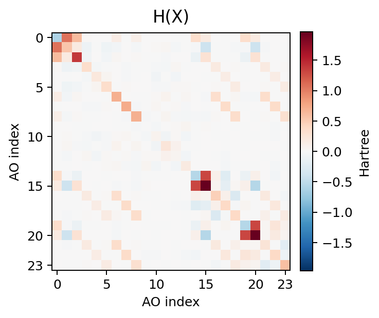
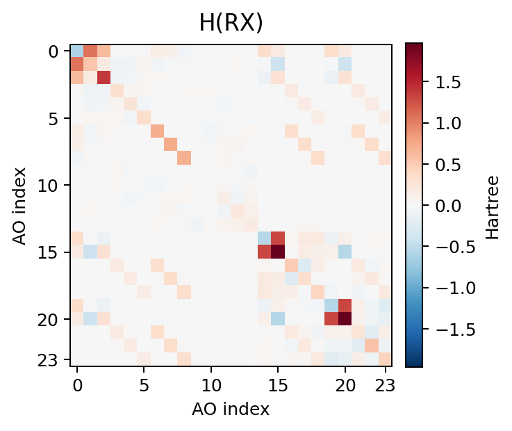
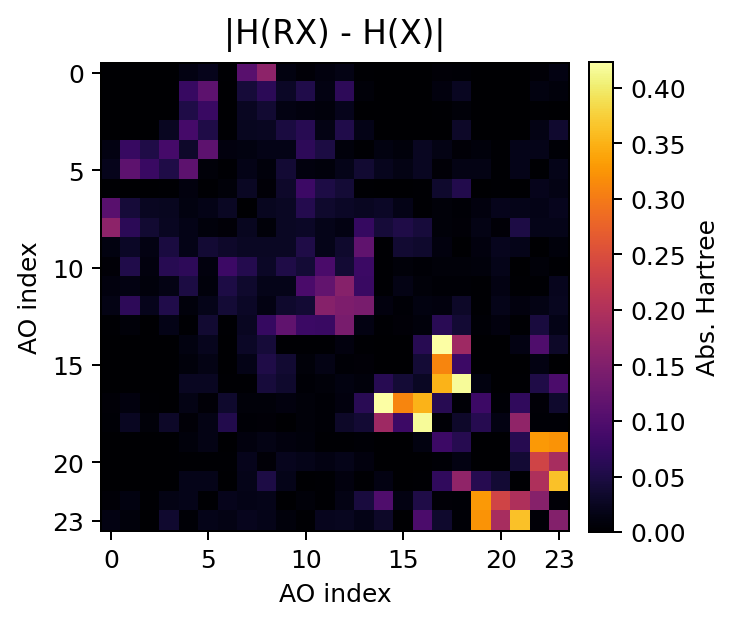
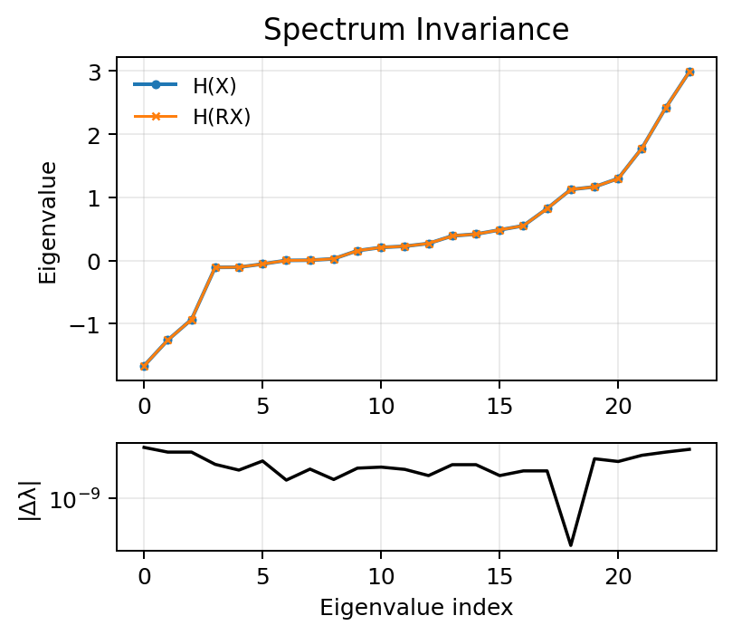

# QHformer v2 Sparsity: Hybrid Multi-Head Attention with Optional SO(2) K/V Operators

QHformer predicts quantum Hamiltonian matrices from molecular geometries with SO(3)-equivariant graph neural networks. The `qhformer_v2_sparsity` branch builds on `qhformer-v2`: it keeps the 4-head CSA/HCA hybrid attention backbone and adds an optional DeePTB-style edge-frame SO(2) K/V operator for attention projections.

- **Multi-head inner-product attention** with head splitting only along irrep multiplicity axes.
- **CSA (Compressed Sparse Attention)** layers with invariant indexer scoring and per-destination top-k edge selection.
- **HCA (Heavy Compressed Attention)** layers with low-order K/V compression while keeping full-irrep Q.
- **Optional SO(2) edge-frame K/V convolution** following the EquiformerV2/eSCN rotate-convolve-rotate-back pattern.
- **CSA-HCA-CSA-HCA** alternating pattern across the default 4 GNN layers.
- **Identity-initialized NormGate and attention residuals** so random-parameter models preserve non-scalar equivariant channels instead of collapsing to invariants.

The CSA/HCA naming and alternating sparse/compressed attention layout are inspired by the DeepSeek-V4 hybrid attention architecture. QHformer v2 adapts that idea to SO(3)-equivariant molecular graphs: compression and sparsity are applied to equivariant edge attention and K/V irreps rather than to transformer token KV caches.

The old single-head attention path is intentionally not retained in this branch.

## Branch Status

This branch is the active performance branch after `qhformer-v2`.

| Branch | Role | Main technical changes |
|--------|------|------------------------|
| `qhformer-v2` | Hybrid-attention baseline | Replaces the legacy single-head attention stack with 4-head CSA/HCA layers, identity-initialized NormGate/residuals, half-edge Hamiltonian assembly, MD17/QH9 utilities, and equivariance diagnostics. |
| `qhformer_v2_sparsity` | Current SO(2)/sparsity branch | Adds optional `attention_operator="so2"` K/V projections, DeePTB-style per-`|m|` packed channel mixing, device-safe Wigner-D sin/cos rotations, rotation caching, attention sparsity benchmarks, and single-molecule profiling utilities. |

The default remains `attention_operator="tp"` for compatibility with the tensor-product path. Set `attention_operator="so2"` when running the SO(2) K/V operator experiments.

## Key Ideas

### Hamiltonian Equivariance

For a molecular rotation \(R\), the Hamiltonian is not expected to remain elementwise invariant. In a real atomic-orbital basis it should transform as:

\[
H(RX) = U(R) H(X) U(R)^T
\]

where \(U(R)\) is the block Wigner-D representation induced by the basis orbitals. Therefore:

- Matrix entries can and should change under rotation.
- Trace and eigenvalues should remain invariant.
- Elementwise invariance under rotation is a failure mode for Hamiltonian prediction.

### Multi-Head Inner Product Attention

The branch keeps the invariant attention score construction from inner products of matching irreps, but computes it per head. For an irrep block such as:

\[
128x0e + 128x1o + 128x2e + 128x3o + 128x4e
\]

with `num_heads=4`, each multiplicity is split into 4 groups:

\[
32x0e + 32x1o + 32x2e + 32x3o + 32x4e
\]

The split never cuts across the \(2l+1\) irrep dimension.

### Hybrid CSA/HCA Backbone

The hybrid layer design follows the same high-level separation used in DeepSeek-V4:

- CSA: moderately compressed attention plus learned sparse selection.
- HCA: heavier K/V compression with a cheaper dense attention path over compressed carriers.

In this repository those ideas are reinterpreted for molecular graphs and irreducible representations, so all scoring inputs remain rotation-invariant and all value carriers remain equivariant.

Default layer pattern:

```text
Layer 0: CSA
Layer 1: HCA
Layer 2: CSA
Layer 3: HCA
```

CSA computes a cheap invariant indexer score on all graph edges, selects top-k incoming edges per destination node, then computes expensive K/V tensor products only on selected edges.

HCA keeps full-irrep queries but compresses K/V to low angular order:

```text
Q: full l = 0..4
K/V: l <= hca_lmax
```

After HCA aggregation, missing high-order value channels are zero-padded before the output projection. This is an architectural compression, not a clamp on equivariant features.

## Project Structure

```text
QHformer/
├── models/
│   ├── __init__.py
│   ├── inner_product_attention.py     # Multi-head, CSA, HCA attention layers
│   ├── so2_ops.py                     # Edge-frame SO(2) convolution operators
│   └── qhformer.py                    # Main QHformer model
├── scripts/
│   └── generate_equivariance_panels.py # README equivariance figure generator
├── training/
│   ├── train_qhformer.py              # MD17/SchNOrb water training entrypoint
│   ├── measure_water_memory.py        # CUDA memory measurement utility
│   └── monitor_training.sh
├── tests/
│   └── test_hybrid_equivariance.py    # Hybrid attention equivariance checks
├── utils/
│   ├── data_utils.py
│   └── ori_dataset.py
├── images/
│   └── equivariance/
│       ├── h_original.png
│       ├── h_rotated.png
│       ├── h_delta_abs.png
│       └── spectrum_invariance.png
└── README.md
```

## Installation

The project depends on PyTorch, PyTorch Geometric, e3nn, and the PyG CUDA extensions used by the original QHformer/QHNet code path.

```bash
pip install -r requirements.txt
```

The remote training run in this branch used:

```bash
/home/yjiao/opt/miniconda3/envs/deeepmolh_e3/bin/python
```

## Usage

### Instantiate QHformer v2

```python
from models.qhformer import QHformer

model = QHformer(
    in_node_features=4,
    sh_lmax=4,
    hidden_size=256,
    bottle_hidden_size=64,
    num_gnn_layers=4,
    max_radius=12,
    num_nodes=10,
    radius_embed_dim=64,
    attention_temperature=1.0,
    num_heads=4,
    use_hybrid_attention=True,
    csa_top_k=8,
    hca_lmax=3,
    indexer_compress_dim=32,
    attention_score_residual_init_std=0.0,
    attention_operator="tp",     # "tp" or "so2"
)

outputs = model(batch_data)
hamiltonian = outputs["hamiltonian"]
```

Set `use_hybrid_attention=False` to run all layers as dense multi-head inner-product attention.

Set `attention_operator="so2"` to replace attention K/V tensor products with edge-frame SO(2) convolutions.

## Architecture

### GNN Layer Stack

```text
Molecular graph
  ├─ atomic embedding: Z -> hidden scalar irreps
  ├─ spherical harmonics: edge vectors -> Y_lm(r_ij), l = 0..4
  └─ radial embedding: |r_ij| -> Bernstein RBF

GNN layer 0: CSA multi-head inner-product attention
GNN layer 1: HCA multi-head inner-product attention
GNN layer 2: CSA multi-head inner-product attention
GNN layer 3: HCA multi-head inner-product attention

SelfNet / PairNet
  └─ equivariant node and pair features

Expansion
  └─ AO block tensors -> assembled Hamiltonian matrix
```

The attention stack produces equivariant node features. The QHNet-style expansion modules then convert equivariant node and pair features into diagonal and off-diagonal atomic-orbital Hamiltonian blocks.

### Multi-Head Split/Merge

`split_irreps_multiplicity(x, irreps, num_heads)` rewrites flat irrep tensors from `[N, D]` to `[N, H, D_head]` by splitting only the multiplicity of each irrep block:

```text
[N, mul * (2l + 1)]
  -> [N, num_heads, mul / num_heads, 2l + 1]
  -> [N, num_heads, D_l_head]
```

`merge_heads` performs the exact inverse. This is the key mechanical constraint for preserving SO(3) structure in the multi-head implementation.

### Attention Score Path

For each head, `MultiHeadInnerProduct` computes invariant channels by taking inner products between matching Q/K irreps:

```text
Q_i^h, K_ij^h -> invariant channels [E, num_invariants, num_heads]
```

`InvariantAttentionScore` then maps these invariant channels to logits. Its residual scorer is initialized to exactly zero by default:

```text
logits = sum(invariant_channels) + residual_scorer(invariant_channels)
```

At initialization this matches the old inner-product sum, while still allowing training to learn nonuniform invariant-channel combinations.

### CSA Layer

CSA uses a cheap invariant indexer before expensive tensor-product K/V construction:

```text
all edges
  -> scalar indexer score from node scalar features + radial embedding
  -> top-k incoming edges per destination node
  -> K/V tensor products only on selected edges
  -> multi-head inner-product attention
  -> head merge and output projection
```

This reduces K/V tensor-product work and attention memory when molecular graphs have many edges.

### HCA Layer

HCA keeps query features full-rank but compresses K/V to low angular order:

```text
Q_i:   l = 0..4
K_ij:  l <= hca_lmax
V_ij:  l <= hca_lmax
```

After aggregation, omitted high-order value channels are padded with zeros before the output projection. The query still sees the full directional state; the compression only limits the key/value carrier used by that layer.

### SO(2) Edge-Frame K/V Operator

`SO2EdgeConv` follows the DeePTB-E3/EquiformerV2/eSCN reduction of SO(3) convolution to an edge-aligned SO(2) convolution:

```text
global irreps
  -> deterministic local frame with z aligned to r_ij
  -> SO(2)-equivariant local mixing
  -> rotate back to global irreps
```

The current QHformer operator uses DeePTB-style per-`|m|` dense mixing:

- each `|m|` subspace is extracted from the e3nn real irrep basis using the z-rotation generator,
- edge-frame rotation and canonical `m`-basis conversion are fused into one per-`l` transform before per-`m` mixing,
- canonical `m` channels are packed into contiguous per-`m` slices before the SO(2) linear mixing and unpacked once before rotating back,
- the reverse canonical-to-global transform is fused before returning to e3nn flat irreps,
- `m=0` uses real dense channel mixing,
- `m>0` uses real/imag paired mixing equivalent to a complex SO(2)-linear map,
- external edge weights modulate input or output channels, while dense mixing weights are shared parameters.

This keeps the operator rotation-equivariant while introducing edge-direction-dependent K/V messages and cross-`l` nonzero-`m` mixing. It is enabled with `attention_operator="so2"`. `SO2EdgeConv` caches detached edge-frame Wigner-D rotation blocks by angular order `l` after the first forward for a repeated static edge geometry, so later forwards can reuse one rotation block per `l`. The cache is invalidated by changed edge vectors, dtype, device, or module device moves. Set `detach_rotations=False` on the operator when geometry gradients are required; that path disables cache reuse for those rotations and keeps gradients flowing to `edge_vec`.

### NormGate and Residuals

`NormGate` is identity-initialized:

```text
scalar_out     = scalar_x + residual_scalar
non_scalar_out = non_scalar_x * (1 + residual_gate)
```

with the last gate layer initialized to zero. Attention layer residuals use the original layer input, not the gated/projection intermediate. These two details avoid the failure mode where random-parameter GNN features collapse to scalar invariants.

## Training Entry Point

Default water configuration in `training/train_qhformer.py`:

| Parameter | Default |
|-----------|---------|
| `hidden_size` | 256 |
| `bottle_hidden_size` | 64 |
| `num_gnn_layers` | 4 |
| `num_heads` | 4 |
| `use_hybrid_attention` | `True` |
| `csa_top_k` | 8 |
| `hca_lmax` | 3 |
| `indexer_compress_dim` | 32 |
| `attention_score_residual_init_std` | 0.0 |
| `attention_operator` | `"tp"` |
| `batch_size` | 512 |
| `num_epochs` | 15000 |
| `learning_rate` | 1e-3 |
| `warmup_start_lr` | 1e-7 |
| `warmup_epochs` | 1000 |
| `min_lr` | 1e-5 |
| `train_split` / `test_split` | 0.8 / 0.2 |
| `save_interval` | 50 epochs |

Run:

```bash
python training/train_qhformer.py
```

The loss keeps the previous form:

\[
\mathcal{L} = \mathrm{MAE}(H, \hat{H}) + \mathrm{MSE}(H, \hat{H})
\]

MAE is used as the primary reporting metric.

### Measure Per-Molecule Memory

```bash
python training/measure_water_memory.py \
  --data-root /home/yjiao/QHformer/dataset \
  --molecule water \
  --device cuda:0 \
  --batch-sizes 128,256,512 \
  --hca-lmax 3 \
  --attention-operator so2
```

### Attention Sparsity Benchmark

Run the remote GPU micro-benchmark for dense TP, SO(2) K/V operators, and CSA/HCA variants:

```bash
CUDA_VISIBLE_DEVICES=6 python scripts/benchmark_attention_sparsity.py \
  --device cuda \
  --hidden-size 64 \
  --num-nodes 64 \
  --num-edges 2048 \
  --iters 20 \
  --warmup 5 \
  --top-k 8 \
  --hca-lmax 3 \
  --json
```

Current remote GPU6 result on `c20`, RTX 5090, `DeepMolH`, `CUDA_VISIBLE_DEVICES=6`, hidden 64 / nodes 64 / edges 2048, 20 timed iterations:

| Config | Dense TP | SO(2) | Speedup | Peak memory |
|--------|----------|-------|---------|-------------|
| Operator only | 2.25 ms | 2.10 ms | 1.07x | 216 MB -> 151 MB |
| Full attention | 10.39 ms | 10.17 ms | 1.02x | 583 MB -> 380 MB |

Hybrid GPU result on the same hidden 64 / nodes 64 / edges 2048 benchmark:

| Variant | Runtime | Speedup vs dense TP attention | Peak memory ratio |
|---------|---------|-------------------------------|-------------------|
| Dense TP | 11.16 ms | 1.00x | 100% |
| CSA + TP | 10.53 ms | 1.06x | 33.1% |
| CSA + SO(2) | 9.65 ms | 1.16x | 24.0% |
| HCA + TP | 10.61 ms | 1.05x | 27.1% |
| HCA + SO(2) | 9.53 ms | 1.17x | 24.4% |

The SO(2) hot path now follows DeePTB-style real/imag `m>0` mixing with one linear projection per `|m|`, and detached Wigner-D rotations use precomputed axis bases with runtime `sin`/`cos` blocks on the input device instead of CPU round-trips or runtime matrix exponentials. A dynamic-geometry `cache_rotations=False` micro-benchmark on the same GPU and hidden 64 / edges 2048 setup improved from 767 ms to 18.8 ms per SO(2) operator call. The operator still launches separate PyTorch kernels for packing, per-`m` mixing, unpacking, and the final fused reverse transform; a fused/channel-native kernel is the next target if SO(2) becomes the default training operator.

## Verification

Run the hybrid equivariance tests:

```bash
python -m pytest tests/test_hybrid_equivariance.py -q
```

The test coverage checks:

- irrep multiplicity split/merge round trip,
- invariant attention scorer zero-residual initialization,
- optional nonzero scorer residual initialization,
- identity initialization of `NormGate`,
- CSA/HCA/multi-head forward finite output,
- CSA-HCA-CSA-HCA construction in `QHformer`,
- SO(2) edge convolution rotation equivariance, DeePTB-style packed `m` channel indexing, fused rotation/`m`-basis transforms, angular-order rotation cache reuse, nonzero-`m` cross-`l` mixing, and optional geometry-gradient support,
- Hamiltonian trace/eigenvalue invariance under random water rotations.

Latest local verification:

```text
pytest -q tests/test_so2_ops.py tests/test_hca_sparse_attention.py tests/test_hybrid_equivariance.py
26 passed
pytest -q
30 passed
```

A random-parameter water rotation diagnostic after the NormGate/residual fix showed non-invariant matrix entries with invariant spectrum:

```text
max |H(RX) - H(X)| = 4.24e-1
mean |H(RX) - H(X)| = 3.38e-2
max eigenvalue diff = 1.91e-6
trace diff = 1.91e-6
```

### README Equivariance Panels

Generate the standalone documentation panels with:

```bash
python scripts/generate_equivariance_panels.py
```

The panels use a randomly initialized small QHformer v2 on one water molecule. They are architecture/equivariance diagnostics, not training results.

| Original orientation | Rotated orientation |
|---|---|
|  |  |

| Elementwise matrix change | Spectrum invariance |
|---|---|
|  |  |

## Implementation Notes

- Attention softmax includes a NaN fallback to uniform weights.
- Scorer residual weights are initialized to exactly zero by default, so the initial score equals the original invariant inner-product sum.
- `attention_score_residual_init_std` can be set nonzero for experiments; this preserves equivariance because it mixes invariant channels only.
- HCA zero-padding uses zeros for omitted high-order channels and does not clamp non-scalar features.
- `NormGate` is identity-initialized to avoid suppressing directional channels at initialization.
- The H/He/light first-row orbital mask uses `[0, 1, 3, 4, 5]`; O and heavier atoms use the full 14-orbital mask, giving a 24 x 24 H2O Hamiltonian.

## References

1. QHNet: [Divel-DiNISR/QHNet](https://github.com/Divel-DiNISR/QHNet)
2. DeepSeek-V4: [Technical report](https://huggingface.co/deepseek-ai/DeepSeek-V4-Flash/blob/main/DeepSeek_V4.pdf) and [Transformers model documentation](https://huggingface.co/docs/transformers/main/model_doc/deepseek_v4)
3. e3nn: [e3nn documentation](https://docs.e3nn.org/)
4. EquiformerV2: [atomicarchitects/equiformer_v2](https://github.com/atomicarchitects/equiformer_v2)
5. Reducing SO(3) Convolutions to SO(2): [arXiv:2302.03655](https://arxiv.org/abs/2302.03655)
6. DeePTB-E3: [deepmodeling/DeePTB](https://github.com/deepmodeling/DeePTB), [ICLR 2025 Spotlight](https://openreview.net/forum?id=kpq3IIjUD3)
7. DeepH-2: [mzjb/DeepH-pack](https://github.com/mzjb/DeepH-pack)

## Author

**Yuan Jiao (焦源)**

- GitHub: [STOKES-DOT](https://github.com/STOKES-DOT)
- Email: jiaoyuan24@mails.ucas.ac.cn
- ORCID: [0009-0006-9418-5545](https://orcid.org/0009-0006-9418-5545)
- Institution: University of Chinese Academy of Sciences (UCAS)

## License

MIT License - see LICENSE file for details.

## Citation

```bibtex
@software{jiao2026qhformer,
  title={QHformer: SO(3)-Equivariant Hamiltonian Prediction with Hybrid Multi-Head Attention},
  author={Jiao, Yuan},
  year={2026},
  url={https://github.com/STOKES-DOT/QHformer},
  institution={University of Chinese Academy of Sciences}
}
```
