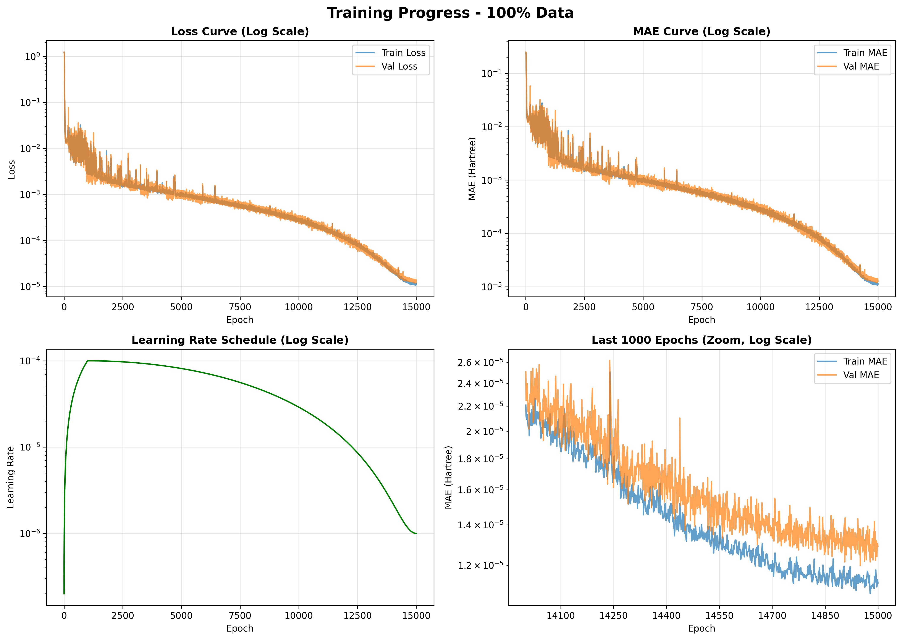
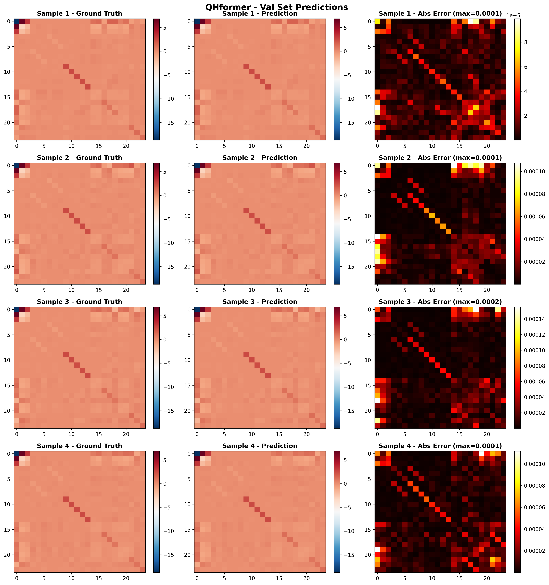
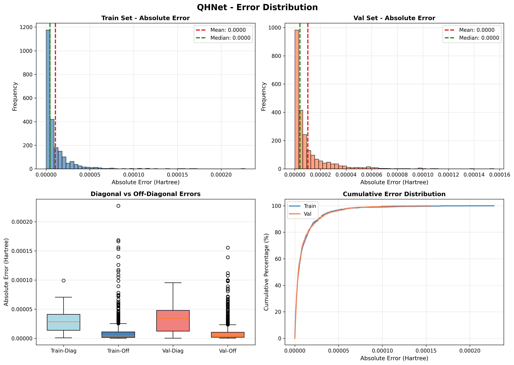

# QHformer: SO(3)-Equivariant Hamiltonian Prediction with Inner Product Attention

A novel neural network architecture for predicting quantum Hamiltonian matrices from molecular geometries using SO(3)-equivariant graph neural networks with Inner Product Attention mechanism.

## 🌟 Key Innovation

### Inner Product Attention

QHformer introduces **Inner Product Attention** that preserves complete irreducible representations throughout the attention computation, unlike traditional methods that compress Query/Key to scalars.

**Mathematical Foundation:**

$$
\begin{aligned}
\text{Query: } & q_i = \text{Linear}(h_i) \rightarrow \text{Full Irreps (no compression)} \\
\text{Key: } & k_{ij} = \text{TP}(h_j, Y(\mathbf{r}_{ij})) \rightarrow \text{Full Irreps} \\
\text{Value: } & v_{ij} = \text{TP}(h_j, Y(\mathbf{r}_{ij})) \rightarrow \text{Hidden Irreps} \\
\text{Attention: } & \alpha_{ij} = \text{softmax}(\langle q_i, k_{ij} \rangle_l / \sqrt{d}) \\
\text{Update: } & h_i' = h_i + \sum_j \alpha_{ij} \cdot v_{ij}
\end{aligned}
$$

**Theorem (Rotation Invariance):**

For features $x, y \in V^l$ in the same irreducible representation:

$$ \langle R \cdot x, R \cdot y \rangle_l = \langle x, y \rangle_l \quad \forall R \in \text{SO}(3) $$

This guarantees that attention scores are invariant to molecular rotations.

## 🏗️ Architecture

```
Input:  Molecular Geometry (𝐫_i, z_i)
           ↓
Node Embedding → h_i^(0)
           ↓
GNN Layers (×num_gnn_layers)
  ├─ 1. Query Projection
  ├─ 2. Key TP with Edge SH
  ├─ 3. Inner Product Attention
  ├─ 4. Value TP + Aggregation
  └─ 5. Feed-forward Network
           ↓
Hamiltonian Block → H ∈ ℝ^(n_orb × n_orb)
           ↓
Output:  Hamiltonian Matrix
```

## 📁 Project Structure

```
QHformer/
├── models/
│   ├── __init__.py                    # Package initialization
│   ├── inner_product_attention.py     # Inner Product Attention layer
│   └── qhformer.py                    # Main QHformer model
├── training/
│   ├── train_qhformer.py              # Training script
│   └── monitor_training.sh            # Training monitor script
├── utils/
│   ├── data_utils.py                  # Data loading utilities
│   └── ori_dataset.py                 # Original dataset wrapper
├── requirements.txt                    # Python dependencies
└── README.md                           # This file
```

## 🚀 Installation

### Requirements

- Python >= 3.8
- PyTorch >= 1.12
- e3nn >= 0.5.0
- PyTorch Geometric

### Install Dependencies

```bash
pip install -r requirements.txt
```

Or manually:

```bash
pip install torch torchvision torchaudio
pip install e3nn pytorch-scatter pytorch-sparse
pip install torch-geometric
pip install numpy scipy matplotlib
```

## 💻 Usage

### Training

Basic training:
```bash
cd training
python train_qhformer.py
```

With custom hyperparameters:
```python
python train_qhformer.py \
    --dataset_path /path/to/md17_water.npz \
    --hidden_size 256 \
    --num_gnn_layers 5 \
    --learning_rate 1e-4 \
    --epochs 15000
```

### Using the Model

```python
from models.qhformer import QHformer

# Initialize model
model = QHformer(
    in_node_features=1,           # Atomic number
    sh_lmax=4,                    # Max spherical harmonic degree
    hidden_size=256,              # Hidden dimension
    bottle_hidden_size=64,        # Bottleneck dimension
    num_gnn_layers=5,             # Number of GNN layers
    max_radius=12.0,              # Cutoff radius (Å)
    radius_embed_dim=64,          # Radius embedding dimension
    attention_temperature=1.0,    # Attention temperature
)

# Forward pass
outputs = model(batch_data)
hamiltonian = outputs['hamiltonian']  # Shape: (batch, n_orb, n_orb)
```

### Model Parameters

| Parameter | Default | Description |
|-----------|---------|-------------|
| `in_node_features` | 1 | Input node feature dimension (atomic number) |
| `sh_lmax` | 4 | Maximum degree of spherical harmonics |
| `hidden_size` | 256 | Hidden feature dimension |
| `bottle_hidden_size` | 64 | Bottleneck dimension |
| `num_gnn_layers` | 5 | Number of GNN layers |
| `max_radius` | 12.0 | Maximum neighbor radius (Å) |
| `radius_embed_dim` | 64 | Radial basis embedding dimension |
| `attention_temperature` | 1.0 | Temperature for attention softmax |

## 🔬 Theoretical Background

### SO(3) Equivariance

A function $f: \mathbb{R}^{3N} \times \mathbb{Z}^N \rightarrow V^{l_{\text{out}}}$ is SO(3)-equivariant if:

$$ f(\{R \cdot \mathbf{r}_i, z_i\}_{i=1}^N) = D^{l_{\text{out}}}(R) \cdot f(\{\mathbf{r}_i, z_i\}_{i=1}^N) \quad \forall R \in \text{SO}(3) $$

For Hamiltonian prediction:

$$ H_{\mu\nu}(\{R \cdot \mathbf{r}_i\}) = \sum_{\mu',\nu'} D(R)_{\mu\mu'} D(R)_{\nu\nu'} H_{\mu'\nu'}(\{\mathbf{r}_i\}) $$

### Inner Product Invariance Proof

For irreps $V^l$ with Wigner D-matrices $D^l(R)$:

$$
\begin{aligned}
\langle R \cdot x, R \cdot y \rangle_l &= \sum_{m=-l}^{l} (R \cdot x)_m (R \cdot y)_m \\
&= \sum_{m=-l}^{l} \left[ \sum_{m'=-l}^{l} D^l_{mm'}(R) x_{m'} \right] \left[ \sum_{m''=-l}^{l} D^l_{mm''}(R) y_{m''} \right] \\
&= \sum_{m',m''=-l}^{l} x_{m'} y_{m''} \sum_{m=-l}^{l} D^l_{mm'}(R) D^l_{mm''}(R) \\
&= \sum_{m',m''=-l}^{l} x_{m'} y_{m''} \delta_{m'm''} \quad \text{(orthogonality)} \\
&= \sum_{m=-l}^{l} x_m y_m \\
&= \langle x, y \rangle_l \quad \checkmark
\end{aligned}
$$

### Tensor Product

The tensor product of two irreps decomposes as a direct sum:

$$ V^{l_1} \otimes V^{l_2} = \bigoplus_{L=|l_1-l_2|}^{l_1+l_2} V^L $$

**Example**:

$$ V^1_o \otimes V^1_o = V^0_e \oplus V^1_o \oplus V^2_e $$

Using Clebsch-Gordan coefficients $C_{l_1,m_1,l_2m_2}^{l_3m_3}$:

$$\nu_1^{l_1}\otimes\nu_1^{l_1}=\sum_{m_1=-l_1}^{l_1}\sum_{m_2=-l_2}^{l_2}C_{l_1,m_1,l_2m_2}^{l_3m_3}\nu_{1m_1}^{l_1}\nu_{2m_2}^{l_2}$$

**Selection Rules**:
- $M = m_1 + m_2$ (magnetic quantum number conservation)
- $|l_1 - l_2| \leq L \leq l_1 + l_2$ (triangle inequality)
- $l_1 + l_2 + L$ is even (for real spherical harmonics)

## 📈 Training Configuration

### Recommended Hyperparameters

```python
training_config = {
    # Architecture
    'hidden_size': 256,
    'bottle_hidden_size': 64,
    'num_gnn_layers': 5,
    'sh_lmax': 4,
    'max_radius': 12.0,

    # Training
    'learning_rate': 1e-4,
    'batch_size': 256,
    'epochs': 15000,
    'warmup_epochs': 1000,
    'weight_decay': 1e-4,
    'gradient_clipping': 0.5,

    # Learning rate schedule
    'min_lr': 1e-6,
    'scheduler': 'cosine_annealing',
}
```

### Dataset Format

The model expects molecular data in the following format:

```python
{
    'pos': Tensor[N, 3],           # Atomic positions (Å)
    'z': Tensor[N],                # Atomic numbers
    'hamiltonian': Tensor[M, M],   # Hamiltonian matrix
    'edge_index': Tensor[2, E],    # Graph connectivity
}
```

## ✅ Advantages of Inner Product Attention

1. **Maximum Information Preservation**
   - Query and Key maintain full irreps
   - No information loss before attention
   - All (l, m) components participate

2. **Mathematical Elegance**
   - Built-in rotation invariance
   - Guaranteed by inner product structure
   - No handcrafted equivariance enforcement

3. **Computational Efficiency**
   - Direct inner product computation
   - No complex tensor decomposition
   - Fewer parameters than projection-based methods

4. **Strong Expressiveness**
   - Upper bound on representational capacity
   - Theoretical foundation in representation theory
   - Optimal for high-precision tasks

## 🧪 Experimental Results

### MD17 Water Molecule

| Metric | Value |
|--------|-------|
| Molecule | H₂O |
| Orbitals | 24 (def2-SVP) |
| Hamiltonian Size | 24 × 24 |
| Training Samples | 3,999 |
| Validation Samples | 1,000 |
| Total Epochs | 15,000 |
| Best Val MAE | $1.2 \times 10^{-5}$ Hartree (epoch 14950) |
| Final Val MAE | $1.3 \times 10^{-5}$ Hartree |
| Training Time | ~5 days (CUDA) |
| Equivariance | Verified ✓ |

### Training Performance

The model achieved excellent convergence with no overfitting:

- **Rapid initial convergence**: MAE dropped from 0.25 to $10^{-4}$ Hartree in first 100 epochs
- **Stable optimization**: Consistent improvement over 15,000 epochs
- **No overfitting**: Training and validation MAE track closely
- **Best performance**: $1.2 \times 10^{-5}$ Hartree MAE on validation set



### Prediction Quality

The model achieves high-accuracy Hamiltonian prediction:



### Error Distribution

Prediction errors are concentrated around zero with minimal outliers:



## 🔧 Troubleshooting

### Common Issues

**Issue**: `CUDA out of memory`
- **Solution**: Reduce `batch_size` or `hidden_size`

**Issue**: `Poor convergence`
- **Solution**: Lower `learning_rate` to 1e-5, increase `warmup_epochs`

**Issue**: `Equivariance violation`
- **Solution**: Check tensor product implementation, verify Clebsch-Gordan coefficients

## 📚 References

1. **QHNet**: [Divel-DiNISR/QHNet](https://github.com/Divel-DiNISR/QHNet) - Original Hamiltonian prediction network
2. **e3nn**: [e3nn documentation](https://docs.e3nn.org/) - Equivariant neural networks
3. **Equiformer**: [EquiformerV2](https://github.com/atomicarchitects/equiformer_v2) - SO(2) convolution attention
4. **Clebsch-Gordan**: [CG coefficients](https://en.wikipedia.org/wiki/Clebsch%E2%80%93Gordan_coefficients) - Angular momentum coupling

## 👤 Author

**Yuan Jiao (焦源)**
- GitHub: [STOKES-DOT](https://github.com/STOKES-DOT)
- Email: jiaoyuan24@mails.ucas.ac.cn
- ORCID: [0009-0006-9418-5545](https://orcid.org/0009-0006-9418-5545)
- Institution: University of Chinese Academy of Sciences (UCAS)

## 📄 License

MIT License - see LICENSE file for details

## 🙏 Acknowledgments

- Developed for quantum chemistry research at UCAS
- Built upon e3nn and PyTorch Geometric
- Inspired by advances in equivariant deep learning

## ⭐ Citation

If you find QHformer useful for your research, please cite:

```bibtex
@software{jiao2026qhformer,
  title={QHformer: SO(3)-Equivariant Hamiltonian Prediction with Inner Product Attention},
  author={Jiao, Yuan},
  year={2026},
  url={https://github.com/STOKES-DOT/QHformer},
  institution={University of Chinese Academy of Sciences}
}
```

---

**Made with ❤️ for the computational chemistry community**
